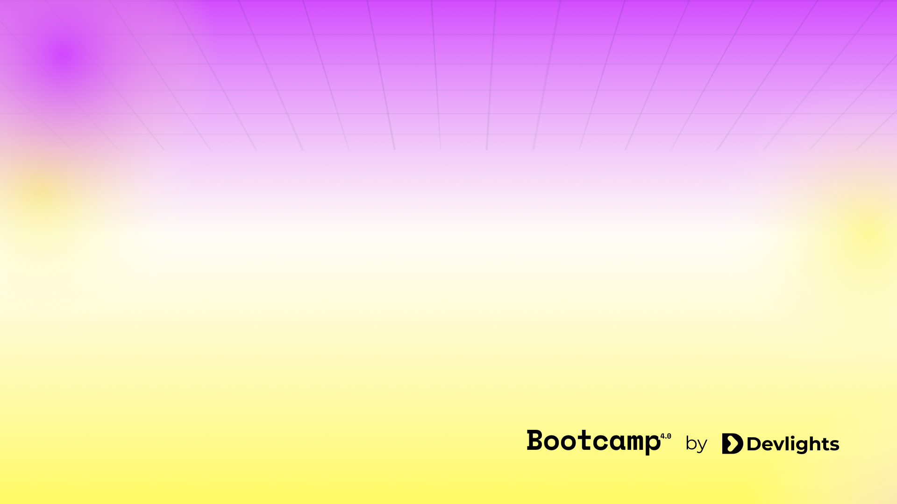

# BOOTCAMP 4.0

- Tuesday:
  - Languages Overview: types, domain, implementation, supported paradigms.
  - Python: Introduction and installation.
  - Ways to run Python code.
  - Basic syntax and structure.

---

